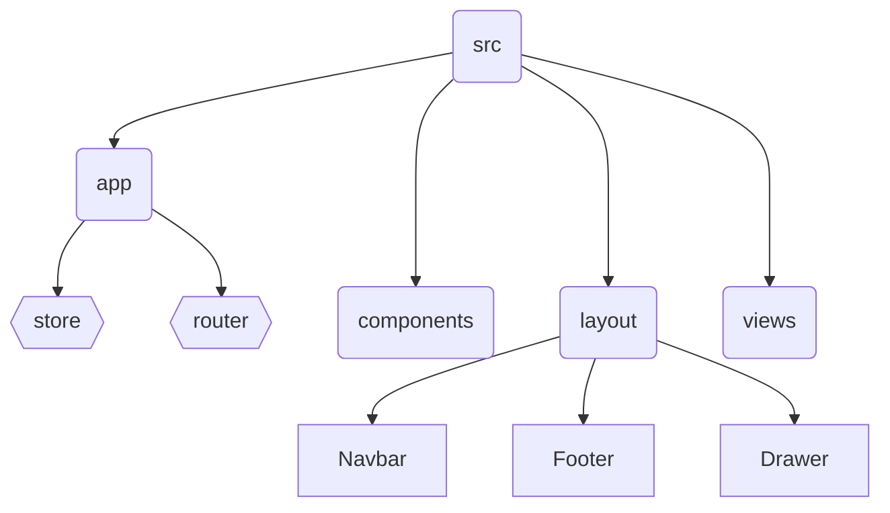

# Notella Kanban

## Preview

You can view the web app deployment here : [Notella](https://notella.netlify.app/)

## Technologies

- pnpm
- Vite
- React
- Typescipt
- Redux Toolkit
- Tailwind CSS
- Postcss

## App Structure



## Prerequisites

- Node
- Vite
- pnpm
- tsc

## Setup

1. Install the required modules
   ```bash
   pnpm install
   ```
2. Run in dev mode
   ```bash
    pnpm run dev
   ```
   or with Vite
   ```bash
   npx vite --port=4000
   ```

## Status

[](https://app.netlify.com/sites/notella/deploys)
